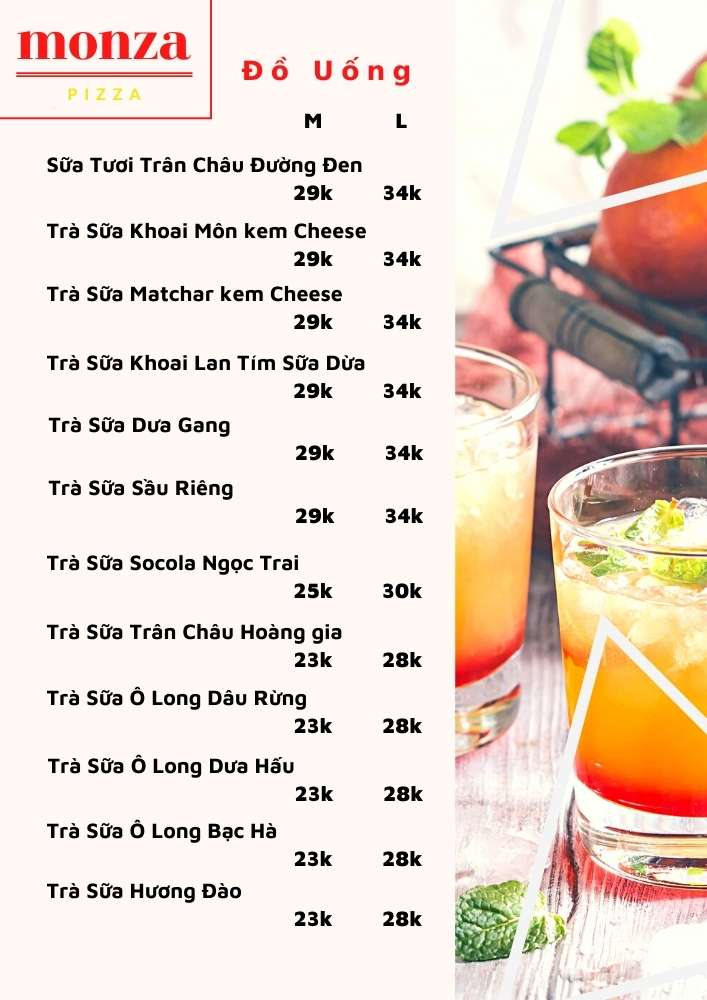

Đây là sản phẩm nghiên cứu khoa học với tên đề tài là "THIẾT LẬP API CHO VIỆC PHÂN TÍCH MENU MÓN ĂN PHỤC VỤ KHÁCH DU LỊCH"

Đây là một đề tài thiết lập, tinh chỉnh và tạo giao diện trên một API có sẵn để phân tích menu món ăn

Người thực hiện: Nhóm KZ

Dưới đây là thông tin và bản quyền của API được sử dụng để thực hiện đề tài

### input:

<p align="center">
    
</p>

### output:

```json
result.json
{
    "image_name": "098.jpeg",
    "infers": [
        {
            "food_name_en": "BLACK SUGAR BUBBLE MILK TEA L",
            "food_name_vi": "SỮA TƯƠI TRÂN CHÂU ĐƯỜNG ĐEN L",
            "food_price": "34000"
        },
        {
            "food_name_en": "TARO CUSTARD CHEESE MILK TEA L",
            "food_name_vi": "TRÀ SỮA KHOAI MÔN KEM CHEESE L",
            "food_price": "34000"
        },
        {
            "food_name_en": "",
            "food_name_vi": "TRÀ SỮA MATCHAR KEM CHEESE L",
            "food_price": "34000"
        },
        {
            "food_name_en": "",
            "food_name_vi": "TRÀ SỮA KHOAI LAN TÍM SỮA DỪA L",
            "food_price": "34000"
        },
        {
            "food_name_en": "MELON MILK TEA L",
            "food_name_vi": "TRÀ SỮA DƯA GANG L",
            "food_price": "34000"
        },
        {
            "food_name_en": "DURIAN MILK TEA L",
            "food_name_vi": "TRÀ SỮA SẦU RIÊNG L",
            "food_price": "34000"
        },
        {
            "food_name_en": "CHOCOLATE PEARL MILK TEA L",
            "food_name_vi": "TRÀ SỮA SOCOLA NGỌC TRAI L",
            "food_price": "30000"
        },
        {
            "food_name_en": "ROYAL BUBBLE MILK TEA L",
            "food_name_vi": "TRÀ SỮA TRÂN CHÂU HOÀNG GIA L",
            "food_price": "28000"
        },
        {
            "food_name_en": "OOLONG WATERMELON MILK TEA L",
            "food_name_vi": "TRÀ SỮA Ô LONG DƯA HẤU L",
            "food_price": "28000"
        },
        {
            "food_name_en": "OOLONG MINT MILK TEA L",
            "food_name_vi": "TRÀ SỮA Ô LONG BẠC HÀ L",
            "food_price": "28000"
        },
        {
            "food_name_en": "PEACH FLAVOUR MILK TEA L",
            "food_name_vi": "TRÀ SỮA HƯƠNG ĐÀO L",
            "food_price": "28000"
        },
        {
            "food_name_en": "BLACK SUGAR BUBBLE MILK TEA M",
            "food_name_vi": "SỮA TƯƠI TRÂN CHÂU ĐƯỜNG ĐEN M",
            "food_price": "29000"
        },
        {
            "food_name_en": "TARO CUSTARD CHEESE MILK TEA M",
            "food_name_vi": "TRÀ SỮA KHOAI MÔN KEM CHEESE M",
            "food_price": "29000"
        },
        {
            "food_name_en": "",
            "food_name_vi": "TRÀ SỮA MATCHAR KEM CHEESE M",
            "food_price": "29000"
        },
        {
            "food_name_en": "",
            "food_name_vi": "TRÀ SỮA KHOAI LAN TÍM SỮA DỪA M",
            "food_price": "29000"
        },
        {
            "food_name_en": "MELON MILK TEA M",
            "food_name_vi": "TRÀ SỮA DƯA GANG M",
            "food_price": "29000"
        },
        {
            "food_name_en": "DURIAN MILK TEA M",
            "food_name_vi": "TRÀ SỮA SẦU RIÊNG M",
            "food_price": "29000"
        },
        {
            "food_name_en": "CHOCOLATE PEARL MILK TEA M",
            "food_name_vi": "TRÀ SỮA SOCOLA NGỌC TRAI M",
            "food_price": "25000"
        },
        {
            "food_name_en": "ROYAL BUBBLE MILK TEA M",
            "food_name_vi": "TRÀ SỮA TRÂN CHÂU HOÀNG GIA M",
            "food_price": "23000"
        },
        {
            "food_name_en": "OOLONG WATERMELON MILK TEA M",
            "food_name_vi": "TRÀ SỮA Ô LONG DƯA HẤU M",
            "food_price": "23000"
        },
        {
            "food_name_en": "OOLONG MINT MILK TEA M",
            "food_name_vi": "TRÀ SỮA Ô LONG BẠC HÀ M",
            "food_price": "23000"
        },
        {
            "food_name_en": "PEACH FLAVOUR MILK TEA M",
            "food_name_vi": "TRÀ SỮA HƯƠNG ĐÀO M",
            "food_price": "23000"
        }
    ]
}
```

## Install requirements

```
pip install -r requirements.txt
```

## RUN API

```
python api.py
```

## ACCESS API

```
http://localhost:5000/
```

## Kết quả DEMO

<p align="center">
    
</p>

<p align="center">
    
</p>

## Thanks for reading
